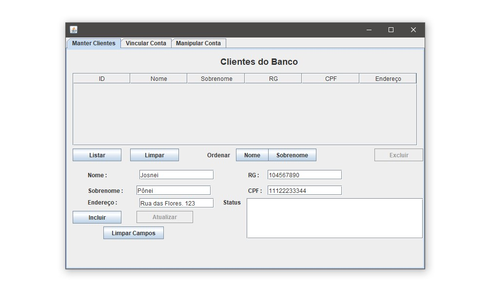

# Swing Bank - The fashionable system for small banks

- **Develepoled by:**
  - [André K. Antunes](https://github.com/andrekantunes)
  - [Cassiano Kruchelski V.](https://github.com/kruchelski)
  - [Julio L. Muller](https://juliolmuller.github.io/)
  - Marco Antonio Nespolo
- **Released on:** Dec 4, 2019
- **Last Updated on:** Dec 14, 2019
- **Latest version:** 1.0.1
- **License:** MIT

## Overview

This application was developed using Java SE and its GUI library Swing, with **no framework**, in order to attend a college assignment for the subject _Object Oriented Programing Language II_, following the specifications detailed in [this document (in portuguese)](./docs/Trabalho%20-%20LPOO2.pdf).

### Technologies & Dev Tools

- Integrated Development Enviroment: [NetBeans 8.2](https://netbeans.org/)
- Text Editor: [Visual Studio Code](https://code.visualstudio.com/)
- Relational Database: [PostgreSQL 11](https://www.postgresql.org/)
- Versioning Tool: [Git](https://git-scm.com/)
- Remote Repository: [GitHub](https://github.com/)
- Console Emulator: [Cmder](https://cmder.net/)

## Enviroment Configuration

The project has been developed entirely with NetBeans (version 8.2), so it is highly recommended to use that to manipulate it, since no other IDE has been tested.

To set up connection to Postgres, you can use rename the file `db.properties.example` on folder `src/` to `db.properties` and add your credentials and local configuration. Since it is a more private data and local configuration, Git should not track that file (see `.gitignore` on the same folder).
